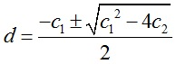
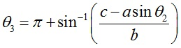
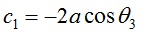

### Introduction

The slider-crank mechanism is one of the most useful mechanisms in modern technology since it appears in most of the internal combustion engines including automobiles, trucks and small engines. The slider-crank kinematic chain consists of four bodies linked with three cylindrical joints and one sliding or prismatic joint. It is used to change circular into reciprocating motion, or reciprocating into circular motion.

Figure 1: Slider Crank

## Position Analysis

Figure 2: Slider Crank system with offset

Above figure shows a slider-crank mechanism in which the stroke-line of the slider doesn't pass through the axis of rotation of the crank. It is also frequently referred as offset slider crank mechanism. Due to offset one of the strokes (forward/reverse) takes lesser time than the other, such mechanisms are known as quick return mechanisms. Ratio of time taken for forward stroke to that for return stroke is called Quick Return Ratio. This is also equal to the ratio of angle swept by crank in the corresponding strokes. The equations for position are as given below.

and

 

Where

   &nbsp;&nbsp; and &nbsp;&nbsp;   

**RELEVANT INDIAN STANDARD FOR IZOD IMPACT TEST**:

1. IS 1598:1977-Method for Izod impact test of metals
2. IS:3766-1977- Method for calibration of pendulum impact testing machines for testing metals
